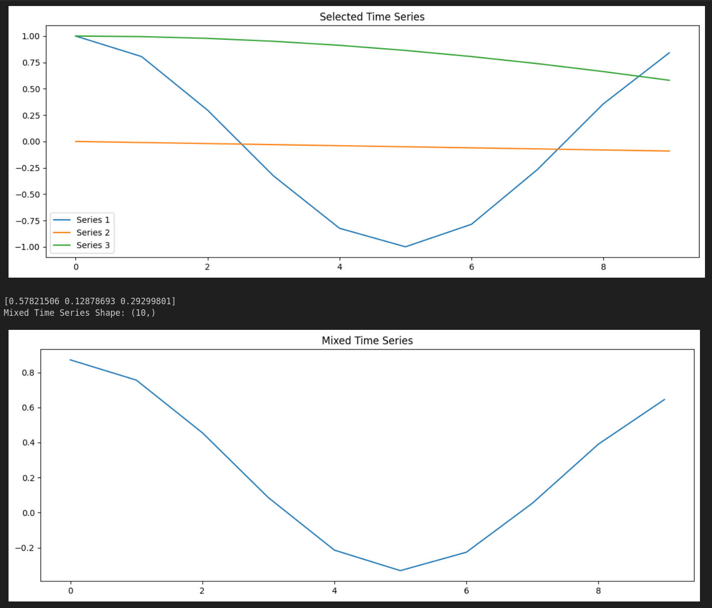

# TSMix: Time Series Mixup

Simple implementation of the TSMix presented in the paper [Chronos: Learning the Language of Time Series](https://arxiv.org/pdf/2403.07815.pdf).
Generating convex combinations of more than two time series pairs. 

